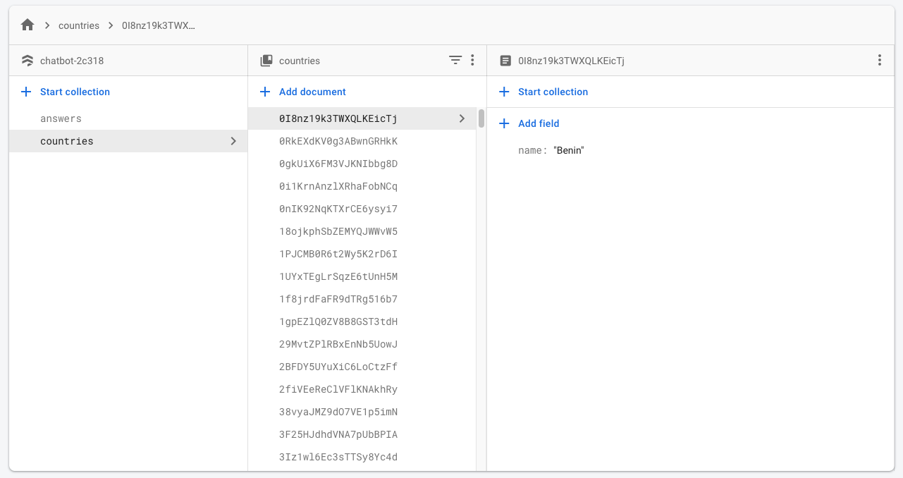
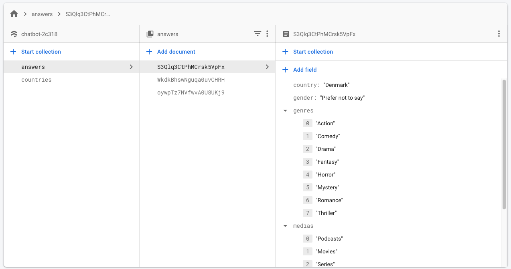

# Flutter Chatbot

Simple chatbot implementation with flutter


## Execute

To run the app you should run as usual in any flutter project, with ```flutter run``` and that is all!

## About

This project is running Flutter 2.0.5 and dart >=2.12.0 <3.0.0, so it uses sound null safety.

## Architecture

The app has the following structure:

```
+ core
+--- di
+--- theme
+ feature
+--- home
+------- data
+------- domain
+------- presentation
```

Where the ```core``` is responsible for injecting dependencies and creating the theme of the app and the ```feature```
has all the available features of the app. In this case, just the home with the chatbot.

On the ```domain``` I created the clients interfaces and models used on the feature. On the ```data``` layer I created
the implementation of clients interfaces. On the ```presentation``` I created all the screen and widgets of the feature,
and the state management implementation.

### State Management

The app uses MobX to state management, and to generate its codes it is using ```mobx_codegen```.

## Database

To get countries suggestions and persist user data, it is using firebase. The countries are on a "countries" collection
with some country names.



All the user anserws are being saved on another collection called "answers".


## Things to improve

There are several things to improve, some of them are on the following list:

- The app does not focus on the last message, so there are messages that are hidden unpurposely.
- When you type to choose your country, you can't choose one that is not on the suggestion list.
- It's possible to choose none of the genres or medias.
- There is no introduction screen explaining how the chatbot works.
- There are no tests.

